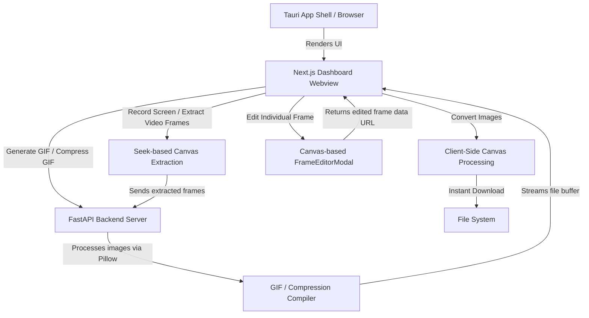

# 🛠️ MotionFlow Studio - Technical Guide

This document contains instructions for setting up the environment, compiling, running, and understanding the architecture of **MotionFlow Studio**.

---

## 🏗️ Architecture & Data Flow

MotionFlow Studio utilizes a hybrid frontend/backend desktop architecture:



*   **Next.js & Framer Motion** provide the user-interactive editor interface with dynamic tab routing.
*   **FrameEditorModal** enables pixel-level operations (filters, rotation, text overlays) client-side using canvas, feeding modified frame buffer URLs back to the editor state.
*   **HTML5 Media & Canvas APIs** are used for client-side screen recording, video playback slicing, and format conversions without backend roundtrips.
*   **FastAPI & Pillow** handle bulk GIF compilation and palette optimization at `localhost:8000`, supporting custom per-frame delays (`durations` parameter).
*   **Tauri** acts as the native desktop wrapper, hosting the web views securely.

---

## ⚙️ Prerequisites

To run or build the application locally, you will need the following tools installed on your machine:

1. **Node.js** (v18.x or higher) & **npm**
2. **Python** (v3.10.x or higher)
3. **Rust Toolchain** (For building the Tauri desktop wrapper)
   - Install via [rustup](https://rustup.rs/).
   - Ensure the `cargo` command is available in your PATH.

---

## 🚀 Setup & Execution

### 1. Backend Service (FastAPI)

1. Open a terminal and navigate to the backend directory:
   ```bash
   cd src-tauri/python-backend
   ```

2. Set up a virtual environment and activate it:
   ```bash
   # Create environment
   python -m venv venv
   
   # Activate (Windows PowerShell)
   .\venv\Scripts\Activate.ps1
   
   # Activate (macOS/Linux)
   source venv/bin/activate
   ```

3. Install the required Python libraries:
   ```bash
   pip install -r requirements.txt
   ```

4. Start the FastAPI development server:
   ```bash
   uvicorn main:app --reload
   ```
   *The backend will now listen for image payloads at `http://127.0.0.1:8000/generate-gif`.*

---

### 2. Frontend & Tauri Wrapper

Open a new terminal window at the project root directory.

1. Install Node modules:
   ```bash
   npm install
   ```

2. Run the application:

   - **Development Browser Sandbox** (Run without Rust/Cargo setup):
     ```bash
     npm run dev
     ```
     Open [http://localhost:3000](http://localhost:3000) to test, modify, and preview changes.

   - **Tauri Desktop Mode** (Runs inside native desktop shell):
     ```bash
     npm run tauri dev
     ```

---

## 📁 Repository Directory Structure

```text
/ (Project Root - Next.js Application)
├── src/
│   ├── app/
│   │   ├── layout.tsx       # Root Next.js layout structure
│   │   ├── page.tsx         # Main UI workstation layout
│   │   └── globals.css      # Core Tailwind styling & custom scrollbar definitions
│   ├── components/
│   │   ├── DragDropZone.tsx # Framer-motion files drop zone
│   │   ├── PreviewGrid.tsx  # Animated, layout-aware preview deck
│   │   ├── SettingsPanel.tsx# Generation parameter inputs
│   │   ├── tools/           # Specialized tool components
│   │   │   ├── GifCreator.tsx       # GIF Timeline, reordering & timing logic
│   │   │   ├── FrameEditorModal.tsx # Canvas frame rotation, text, and filters
│   │   │   ├── VideoToGif.tsx
│   │   │   ├── GifCompressor.tsx
│   │   │   ├── ImageConverter.tsx
│   │   │   └── ScreenRecorder.tsx
│   │   └── ui/              # Shadcn/ui-inspired primitive components
│   │       ├── button.tsx
│   │       └── input.tsx
│   └── lib/
│       ├── api.ts           # Axios/Fetch client connecting to Python endpoints
│       └── utils.ts         # Global Tailwind classes merge utility (cn)
├── src-tauri/
│   ├── Cargo.toml           # Rust desktop configurations and dependencies
│   ├── build.rs             # Tauri compilation script
│   ├── tauri.conf.json      # Tauri app dimensions, menus, and bundles
│   ├── src/
│   │   └── main.rs          # Tauri wrapper entrypoint
│   └── python-backend/
│       ├── main.py          # FastAPI application
│       └── requirements.txt # Python package declarations
├── package.json             # Node script triggers and configurations
├── tailwind.config.ts       # Tailwind CSS configurations
└── tsconfig.json            # TypeScript compile configurations
```

---

## 🛠️ Build Commands

### Create Production Web Bundle
```bash
npm run build
```

### Compile Native Desktop Installer (via Tauri)
```bash
npm run tauri build
```
*(Compiled output will be placed inside `src-tauri/target/release/bundle/`)*
